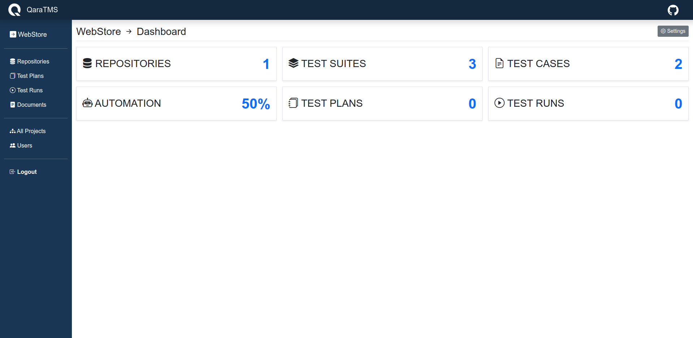
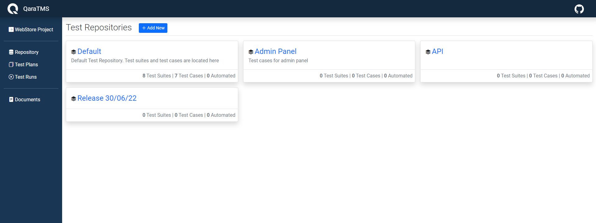
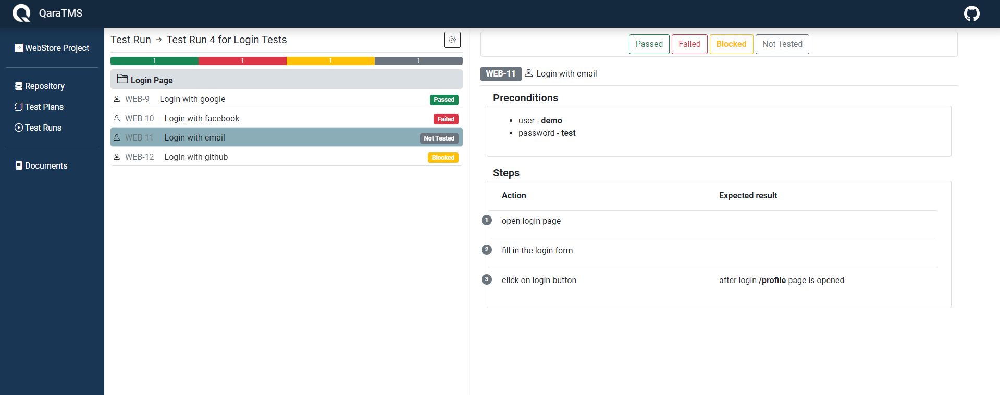
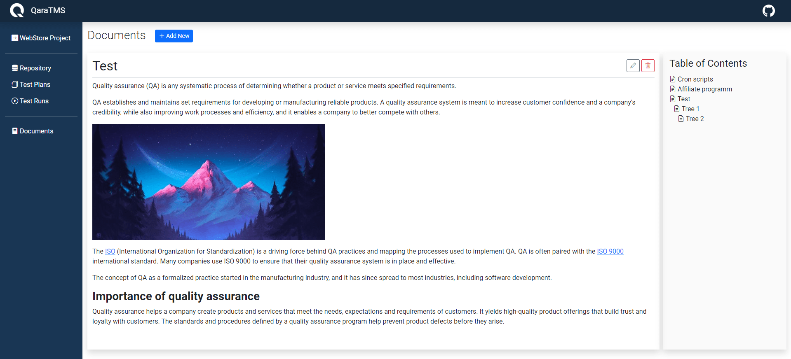

# QaraTMS - Open Source Test Management System

**QaraTMS** is open source test management software for managing test suites, test cases, test plans, test runs and documentation.


## Languages and Tools:

<a href="https://php.net/" title="PHP"></a>
<a href="https://laravel.com/" title="Laravel"></a>
<a href="https://www.w3.org/TR/html5/" title="HTML5"></a>
<a href="https://www.w3.org/TR/CSS/" title="CSS3"></a>
<a href="https://jquery.com/" title="jQuery"></a>
<a href="https://developer.mozilla.org/en-US/docs/Web/JavaScript" title="JavaScript"></a>

## Getting Started

- You will need to install **php 7.4**, **mysql-8** or **SQLite**, **composer**.
- Pull the project from git repository.
- Create a database named `tms` utf8_general_ci, or you can use SQLite.
- Rename `.env.backup` file to `.env` and fill the database information.
- Run `composer install` or ```php composer.phar install```
- Run `php artisan key:generate`
- Run `php artisan migrate`
- Run `php artisan db:seed --class=AdminSeeder` to create admin user and assign permissions.
- Run `php artisan serve`
- You can now access project at **localhost:8000** 
- Login with default email and password - **admin@admin.com** / **password**
- Go to **Users** page and change default email and password. 

If you are using SQLite

* Create **database.sqlite** file in database folder
* Rename `.env_sqlite.backup` file to `.env` and fill the database information.


## How to use it


1. Create Project.



2. Create Test Repository. Test suites and test cases are located in test repository. 
   You can create several test repositories for different project modules - web, admin, API, etc.
   

   
3. Add test suites and test cases. 


4. Create test plan, select cases you need to test. 


5. Start new test run.



6. Also, there is documentation module where you can store your project's documentation. 



## Contributing

Please contribute using [GitHub Flow](https://guides.github.com/introduction/flow). Create a branch, add commits, and [open a pull request](https://github.com/rahuldkjain/github-profile-readme-generator/compare).


## License

QaraTMS is licensed under the [MIT](https://choosealicense.com/licenses/mit/) license.
